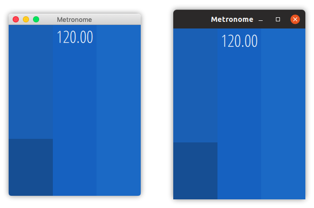

# Metronome
A simple metronome made with Qt and Juce<br>
[](https://travis-ci.com/witte/Metronome)

<div align="center"></div>

## Dependencies
CMake: https://cmake.org/<br>
Qt:    https://www.qt.io/<br>
Juce:  https://github.com/WeAreROLI/JUCE (included)<br>

Linux only: ALSA Development headers (libasound2-dev on Ubuntu)


## Building

```
# Install ALSA dev headers (Linux only)
sudo apt install libasound2-dev

git clone https://github.com/witte/Metronome.git
mkdir build
cd build
cmake .. -DCMAKE_PREFIX_PATH=/Path/to/your/qt/installation
cmake --build .
```

## Credits
The click sample is a mix of these two files:<br>
https://freesound.org/people/Noisehag/sounds/110549/<br>
https://freesound.org/people/Agaxly/sounds/217482/

The font used to display the bpm is Steve Matteson's Open Sans Condensed:<br>
https://fonts.google.com/specimen/Open+Sans+Condensed

## License
GPL-3.0

